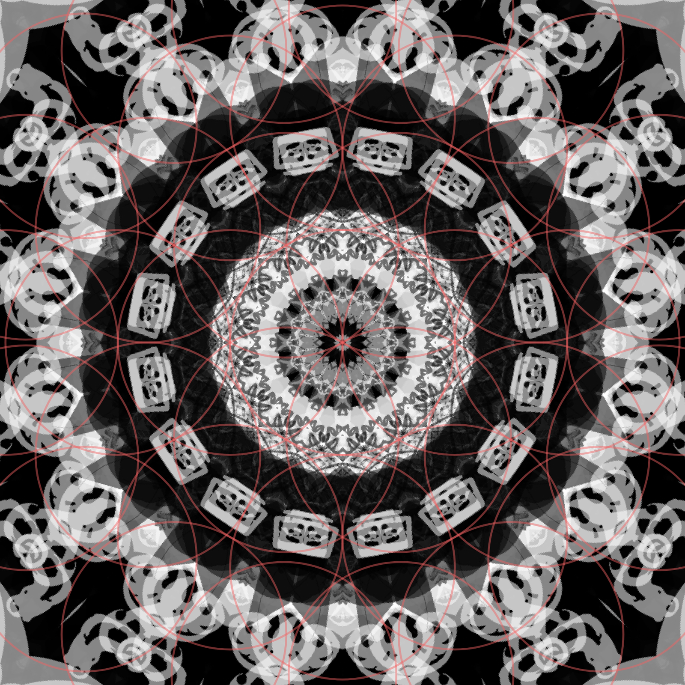
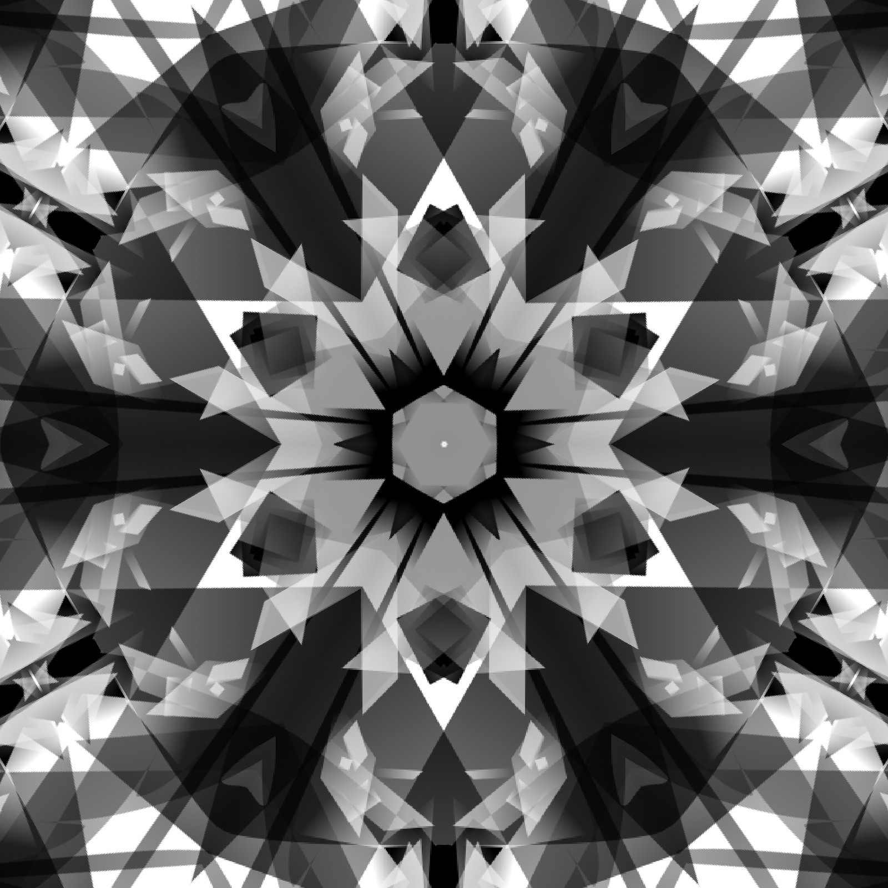
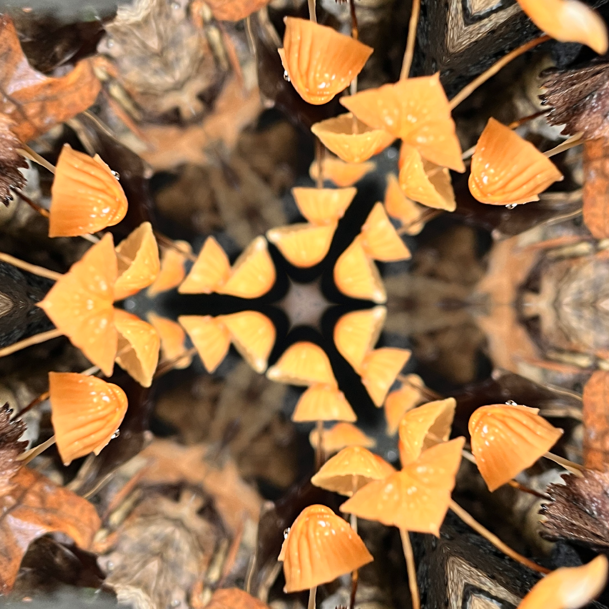
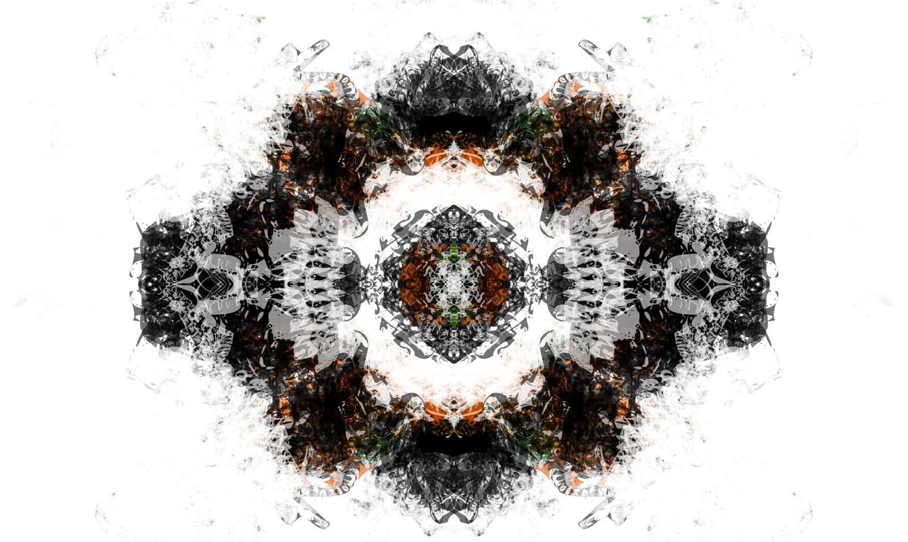
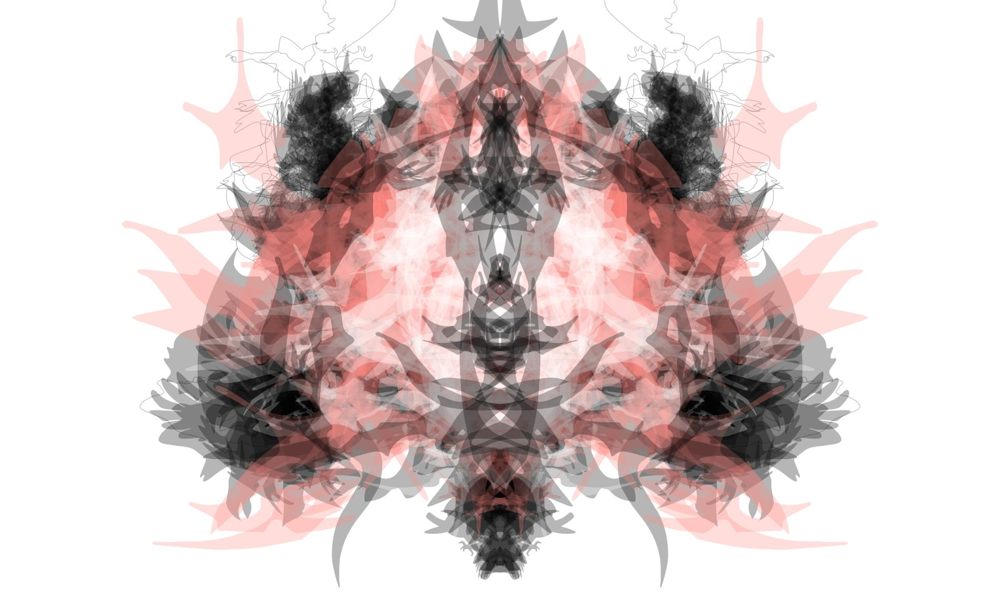
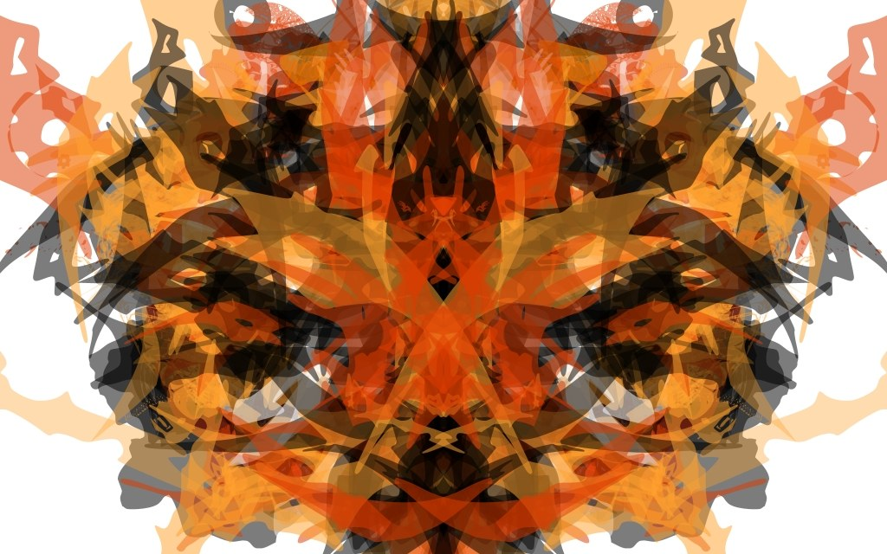
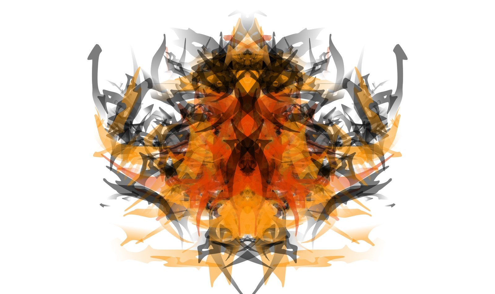
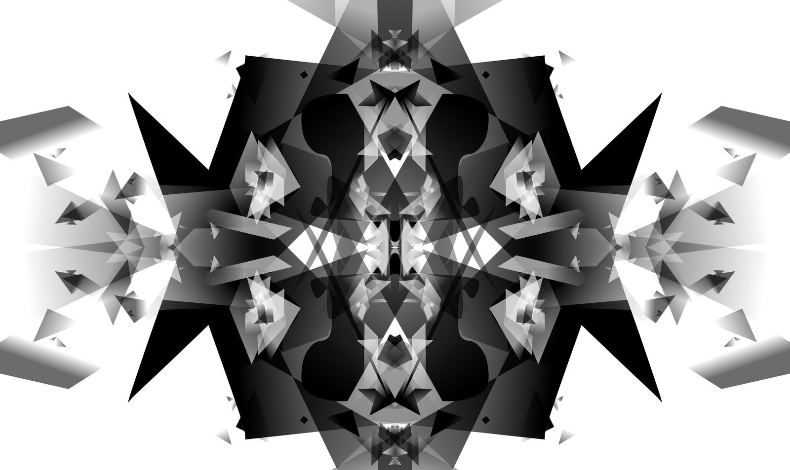

<p align="center">
  
</p>

<p align="center">
  
</p>

# Kaleidoscope Image Lab

**Kaleidoscope Image Lab is a browser-based experimental image instrument for transforming photographs, drawings, and abstract source art into layered kaleidoscopic, geometric, fractal, mathematical, and animated compositions.**

It began as a compact standalone HTML experiment and grew into a full creative lab with symmetry tools, procedural pattern systems, painting, effects, live motion, recording, discovery tools, favorites, and restorable project files.

The project is especially well suited to dense, layered source art. One of my favorite workflows is to build mirrored transparent forms in **Alchemy**, then use Image Lab as a second-stage transformation engine for radial structure, pattern overlays, geometry, motion, and export.

---

## Gallery

### Image Lab outputs

<table>
<tr>
<td width="33%"></td>
<td width="33%"></td>
<td width="33%"></td>
</tr>
</table>

### Alchemy source-art examples

These are examples of the kind of layered, mirrored, semi-transparent source images that work especially well when passed into Image Lab.

<table>
<tr>
<td width="50%"></td>
<td width="50%"></td>
</tr>
<tr>
<td width="50%"></td>
<td width="50%"></td>
</tr>
<tr>
<td colspan="2" align="center"></td>
</tr>
</table>

---

## What it can do

### Symmetry and geometry

- Multiple kaleidoscopic geometry modes
- Mirror and radial symmetry workflows
- Layered symmetry
- Adjustable rotation, scale, center, source position, and related transforms
- Symmetry painting

### Pattern Packs

Image Lab includes several procedural pattern families that share a common overlay/mask/guide system:

- **Sacred Geometry** — Flower of Life families, Vesica forms, Merkaba-style projections, Platonic projections, mandalas, lattices, and related constructions
- **Mathematical Curves** — rose curves, Lissajous forms, hypotrochoids, epitrochoids, spirals, lemniscates, superformula forms, and more
- **Fractals** — Koch, Sierpiński, Dragon, Hilbert, recursive trees, Barnsley-style fern, Apollonian-style circles, Gosper, Hexaflake, Cantor Dust, and others
- **Number Theory** — Ulam/prime spirals, modular multiplication circles, Fibonacci/golden-angle structures, Recamán webs, Pascal modulo patterns, and more
- **Tiling & Tessellation** — triangular/hexagonal grids, Truchet tiles, Voronoi cells, Penrose-inspired rhombi, and Archimedean-style variants
- **Wave Interference** — concentric waves, dual-source ripples, standing-wave grids, moiré fields, harmonic stripes, and Chladni-inspired contours

Patterns can be used as:

- **Overlay** — rendered into the artwork
- **Mask** — constrains/reveals image content while preserving alpha
- **Painting Guide** — visible while working but excluded from export

### Paint and effects

- Non-destructive painting workflow
- Brightness, contrast, saturation, monochrome, vignette, grain, glow, and gradient-map style post-processing
- Reorderable Effect Stack
- Polar transformation stage
- Crystal/faceted transformation stage

### Exploration tools

- Smart Randomizer with weighted profiles and locks
- Mutate workflow
- Procedural Preset Generator with multiple visual styles/intensities
- Discovery Mode with four candidate previews per batch
- Favorites Gallery for saving interesting compositions

### Animation and recording

- Live animation with opt-in motion channels
- Source X/Y motion so the underlying image can move beneath the symmetry system
- Organic motion styles such as drift, orbit, breathe/pulse, wobble, and wander
- Sticky playback controls in the Animation workspace
- Browser-based canvas recording using supported MediaRecorder formats
- Recorded motion uses the live preview as its source

### Projects and export

- New / Open / Save Project workflow
- Versioned `.kilab.json` project files
- Restores supported source data, transforms, patterns, Polar, Crystal, Effects, animation, and Organic Motion settings
- PNG and JPEG image export
- Undo / Redo across normal editing workflows

---

## Quick start

There is currently **no build step and no server requirement**.

1. Clone or download the repository.
2. Open `kaleidoscope-image-lab.html` in a modern desktop browser.
3. Choose **Open Image** and load a source image.
4. Explore the **Source**, **Symmetry**, **Paint**, **Animation**, **Effects**, and **Library** workspaces.
5. Export an image, record an animation, save a Favorite, or save the full composition as a `.kilab.json` project.

### Clone

```bash
git clone https://github.com/stevowitz/kaleidoscope-image-lab.git
cd kaleidoscope-image-lab
open kaleidoscope-image-lab.html
```

Chrome/Chromium has received the most direct testing during development. Some recording/container behavior varies by browser and platform.

---

## A useful source-art workflow

Image Lab works with ordinary photos, but complex source material can create especially interesting results.

A workflow I use often:

1. Build a layered abstract image in **Alchemy**.
2. Mirror it on at least one axis — often both.
3. Alternate colors and transparency to create overlapping forms.
4. Export the source image.
5. Load it into Kaleidoscope Image Lab.
6. Explore symmetry, radial structure, Pattern Packs, Polar/Crystal transformations, effects, and motion.
7. Save good discoveries as Favorites or full project files.

The combination of loose source-generation in Alchemy and structured transformation in Image Lab is a major part of the project's visual identity.

---

## Project structure

The current browser version intentionally remains compact, with the main application living in a standalone HTML file.

```text
kaleidoscope-image-lab.html   Main application
PROJECT_NOTES.md              Development history and implementation notes
DEVELOPMENT_MANUAL.md         Architecture and development guidance
MILESTONE_ROADMAP.md          Milestone history and future direction
AGENTS.md                     Codex/project guidance
Images and logos/             Branding assets
docs/gallery/                 README gallery artwork
```

The standalone HTML architecture made rapid experimentation easy, but it has grown large. A future desktop phase is expected to split the application into a more maintainable source structure while preserving the creative engine.

---

## Current status

The browser version is in a **mature / feature-frozen stage**: the main creative systems are implemented, the UI has received a final polish pass, contextual tooltips have been added, project save/restore works, and the project is now under Git/GitHub version control.

Future work is expected to focus more on packaging, maintainability, and desktop-app conversion than on continuously adding new pattern systems.

---

## Development notes

The application has been developed iteratively with explicit milestones and regression checks. Because the app is embedded through an escaped iframe `srcdoc`, changes are validated at both the outer-document and decoded-inner-document levels, including embedded script parsing and DOM-ID checks.

See:

- [`DEVELOPMENT_MANUAL.md`](DEVELOPMENT_MANUAL.md)
- [`PROJECT_NOTES.md`](PROJECT_NOTES.md)
- [`MILESTONE_ROADMAP.md`](MILESTONE_ROADMAP.md)

for the deeper technical and historical details.

---

## Roadmap

The next major direction is a **standalone desktop application**, while keeping the current browser build as a working reference implementation.

Likely desktop-era goals include:

- native project/open/save workflows
- cleaner source-file architecture instead of one giant embedded HTML document
- stronger native export/recording integration
- continued performance and UI polish
- optional future creative systems such as camera/live-input or deeper cinematic motion tools

---

## Notes

This is an experimental creative tool and an active art/software project. Some features — particularly browser recording formats and native file-dialog behavior — can vary across operating systems and browsers.

If you make something interesting with it, I would genuinely love to see it.
